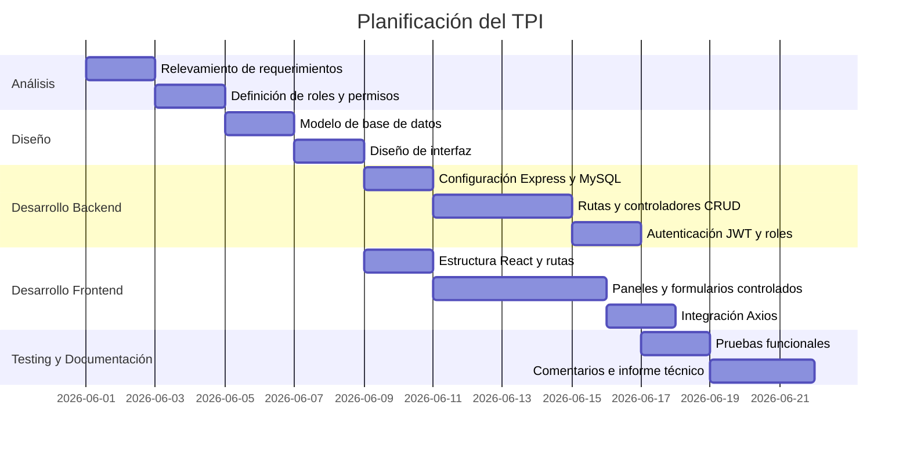
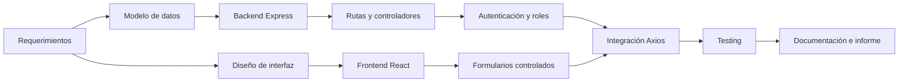
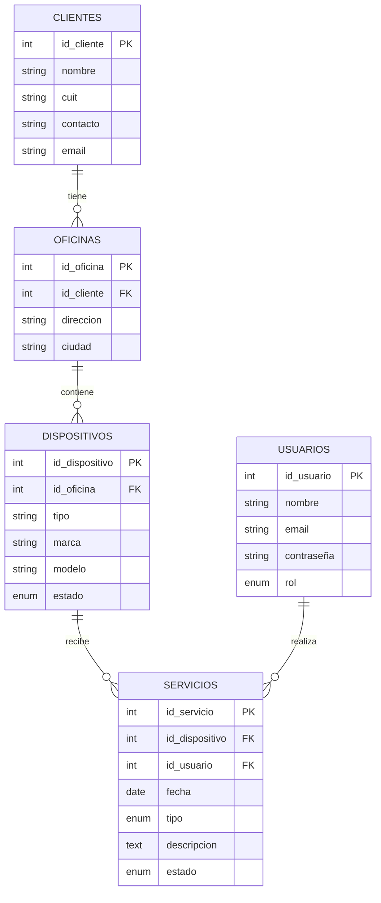
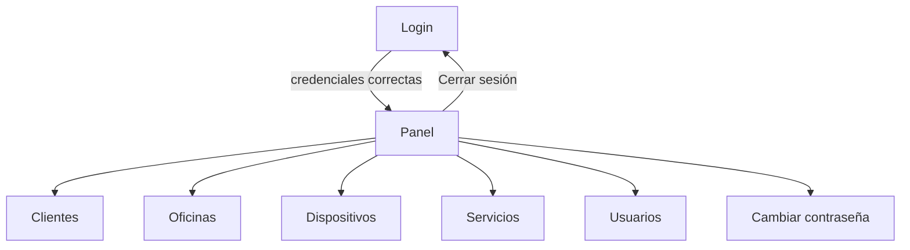

# Informe Técnico - Sistema de Gestión de Servicio Técnico

## Portada

**Proyecto:** Sistema de Gestión de Servicio Técnico  
**Tipo de sistema:** Aplicación web full stack  
**Materia:** Trabajo Práctico Integrador  
**Integrantes:** Completar  
**Docente:** Completar  
**Institución:** Completar  
**Fecha:** Completar  

---

## Índice

1. Requerimientos
2. Tecnologías utilizadas
3. Análisis del sistema
4. Planificación
5. Riesgos
6. Asignación de tareas y roles
7. Diseño de base de datos
8. Diseño de interfaz
9. API del backend
10. Componentes del frontend
11. Código y flujo de información
12. Conclusión

---

## 1. Requerimientos

### Requerimientos del software

El sistema permite gestionar información relacionada con un servicio técnico. La aplicación administra clientes, oficinas, dispositivos/equipos, servicios/trabajos técnicos y usuarios con distintos roles.

### Requerimientos funcionales

| Código | Requerimiento | Descripción |
| --- | --- | --- |
| RF01 | Login de usuarios | El usuario debe iniciar sesión con email y contraseña. |
| RF02 | Control de acceso por roles | El sistema diferencia permisos entre `admin`, `tecnico` y `cliente`. |
| RF03 | Gestión de clientes | El administrador puede crear, listar, editar y eliminar clientes. El técnico solo puede verlos. |
| RF04 | Gestión de oficinas | El administrador puede crear, listar, editar y eliminar oficinas. El técnico solo puede verlas. |
| RF05 | Gestión de dispositivos | Administrador y técnico pueden crear y editar equipos. Solo administrador puede eliminarlos. |
| RF06 | Gestión de servicios | Administrador y técnico pueden crear y editar trabajos. El técnico solo modifica trabajos asignados a él. |
| RF07 | Gestión de usuarios | Solo administrador puede crear, listar, modificar, eliminar y resetear contraseña de usuarios. |
| RF08 | Cambio de contraseña propia | Todo usuario autenticado puede cambiar su contraseña. |
| RF09 | Consulta de relaciones | El sistema muestra a qué cliente pertenece cada oficina y en qué oficina está cada dispositivo. |

### Requerimientos no funcionales

| Código | Requerimiento | Descripción |
| --- | --- | --- |
| RNF01 | Seguridad | Uso de JWT para proteger rutas y bcrypt para guardar contraseñas hasheadas. |
| RNF02 | Mantenibilidad | Separación entre rutas, controladores, configuración y frontend por componentes. |
| RNF03 | Usabilidad | Interfaz con paneles separados por módulo y formularios controlados. |
| RNF04 | Persistencia | Base de datos MySQL/MariaDB ejecutada localmente con XAMPP. |
| RNF05 | Testeabilidad | Backend con Jest/Supertest y frontend con Vitest/Testing Library. |

---

## 2. Tecnologías utilizadas

| Capa | Tecnología | Uso |
| --- | --- | --- |
| Frontend | React | Construcción de interfaz mediante componentes. |
| Frontend | TypeScript | Tipado de props, estados y formularios. |
| Frontend | Vite | Servidor de desarrollo y build del frontend. |
| Frontend | React Router DOM | Navegación entre login y panel protegido. |
| Frontend | Axios | Comunicación HTTP con el backend. |
| Backend | Node.js | Entorno de ejecución JavaScript del servidor. |
| Backend | Express | Definición de servidor, rutas y middlewares. |
| Backend | MySQL2 | Conexión y consultas a MySQL/MariaDB. |
| Backend | bcryptjs | Hash y comparación de contraseñas. |
| Backend | jsonwebtoken | Generación y validación de tokens JWT. |
| Base de datos | MySQL/MariaDB | Persistencia de usuarios, clientes, oficinas, dispositivos y servicios. |
| Testing | Jest + Supertest | Pruebas de endpoints del backend. |
| Testing | Vitest + Testing Library | Pruebas de componentes del frontend. |

---

## 3. Análisis del sistema

### Objetivo

Desarrollar una aplicación web que permita gestionar las operaciones básicas de un servicio técnico: registrar clientes, oficinas, equipos, trabajos realizados y usuarios encargados.

### Actores principales

| Actor | Descripción |
| --- | --- |
| Administrador | Gestiona todos los módulos del sistema. Puede crear usuarios, clientes, oficinas, dispositivos y servicios. |
| Técnico | Consulta clientes y oficinas, carga dispositivos, registra servicios y actualiza trabajos asignados. |
| Cliente | Rol previsto en el modelo, con permisos limitados. |

### Flujo general

1. El usuario ingresa email y contraseña en el login.
2. El frontend envía `POST /auth/login` al backend.
3. El backend valida credenciales contra la base de datos.
4. Si son correctas, genera un token JWT.
5. El frontend guarda el token en `AuthContext` y `localStorage`.
6. Las siguientes peticiones envían el token en el header `Authorization`.
7. El backend valida el token y el rol antes de ejecutar cada operación.
8. Los controladores consultan MySQL y devuelven JSON.
9. React guarda la respuesta en estado y renderiza tarjetas/listas.

---

## 4. Planificación

### Diagrama Gantt



### Diagrama PERT



---

## 5. Tabla de riesgos

| Riesgo | Probabilidad | Impacto | Medida preventiva | Plan de contingencia |
| --- | --- | --- | --- | --- |
| Errores de conexión con MySQL/XAMPP | Media | Alto | Documentar `.env` y script SQL. | Verificar servicio MySQL y credenciales. |
| Permisos incorrectos por rol | Media | Alto | Centralizar validación con middlewares. | Probar endpoints con admin y técnico. |
| Formularios con datos incompletos | Media | Medio | Usar inputs `required` y validaciones backend. | Mostrar mensajes de error. |
| Pérdida de datos por eliminación | Baja | Alto | Restringir DELETE a administrador. | Confirmaciones antes de eliminar. |
| Problemas de codificación con ñ/acentos | Media | Medio | Usar UTF-8 y revisar textos. | Normalizar nombres y probar login/password. |
| Cambios que rompan funcionalidades | Media | Alto | Ejecutar tests backend/frontend. | Revertir o corregir el módulo afectado. |

---

## 6. Asignación de tareas y roles

### Roles del equipo de desarrollo

| Rol | Responsabilidades |
| --- | --- |
| Analista | Relevar requerimientos y definir alcance. |
| Diseñador de BD | Diseñar entidades, claves primarias y foráneas. |
| Desarrollador backend | Implementar Express, rutas, controladores, seguridad y conexión MySQL. |
| Desarrollador frontend | Implementar componentes React, formularios, paneles y navegación. |
| Tester | Probar CRUD, login, permisos y flujo completo. |
| Documentador | Elaborar informe, diagramas y comentarios explicativos. |

### Tareas del proyecto

| Tarea | Responsable | Resultado |
| --- | --- | --- |
| Relevamiento | Analista | Lista de requerimientos. |
| Diseño de BD | Diseñador BD | Script `schema.sql` y modelo relacional. |
| Backend | Desarrollador backend | API REST con Express. |
| Frontend | Desarrollador frontend | Aplicación React con paneles. |
| Seguridad | Backend | JWT, bcrypt y roles. |
| Testing | Tester | Pruebas automáticas y manuales. |
| Documentación | Documentador | Informe final y comentarios en código. |

---

## 7. Diseño de base de datos

### Entidades principales

| Tabla | Descripción |
| --- | --- |
| `usuarios` | Usuarios del sistema con rol y contraseña hasheada. |
| `clientes` | Clientes del servicio técnico. |
| `oficinas` | Oficinas pertenecientes a clientes. |
| `dispositivos` | Equipos ubicados en oficinas. |
| `servicios` | Trabajos técnicos realizados sobre dispositivos por usuarios. |

### Diagrama E-R



### Modelado relacional

```txt
usuarios(
  id_usuario PK,
  nombre,
  email UNIQUE,
  contraseña,
  rol
)

clientes(
  id_cliente PK,
  nombre,
  cuit UNIQUE,
  contacto,
  email
)

oficinas(
  id_oficina PK,
  id_cliente FK -> clientes.id_cliente,
  direccion,
  ciudad
)

dispositivos(
  id_dispositivo PK,
  id_oficina FK -> oficinas.id_oficina,
  tipo,
  marca,
  modelo,
  estado
)

servicios(
  id_servicio PK,
  id_dispositivo FK -> dispositivos.id_dispositivo,
  id_usuario FK -> usuarios.id_usuario,
  fecha,
  tipo,
  descripcion,
  estado
)
```

### Normalización

La base está separada por entidades para evitar redundancia:

- Los datos del cliente se guardan una sola vez en `clientes`.
- Cada oficina referencia a un cliente mediante `id_cliente`.
- Cada dispositivo referencia a una oficina mediante `id_oficina`.
- Cada servicio referencia a un dispositivo y a un usuario técnico.

Esto permite mantener integridad referencial mediante claves foráneas.

---

## 8. Diseño de interfaz

### Vistas principales

| Vista | Descripción |
| --- | --- |
| Login | Formulario para iniciar sesión. |
| Panel | Vista principal posterior al login. |
| Clientes | Lista clientes y permite CRUD según rol. |
| Oficinas | Lista oficinas y muestra cliente asociado. |
| Dispositivos | Lista equipos, ubicación y condición. |
| Servicios | Lista trabajos técnicos y permite cambiar estado. |
| Usuarios | Administración de usuarios. |
| Cambiar contraseña | Formulario para actualizar contraseña propia. |

### Interfaz y navegación



---

## 9. API del backend

### Autenticación

| Método | Ruta | Descripción |
| --- | --- | --- |
| POST | `/auth/login` | Valida credenciales y devuelve token JWT. |

### Clientes

| Método | Ruta | Rol | Descripción |
| --- | --- | --- | --- |
| GET | `/clientes` | admin, tecnico | Lista clientes. |
| POST | `/clientes` | admin | Crea cliente. |
| PUT | `/clientes/:id` | admin | Modifica cliente. |
| DELETE | `/clientes/:id` | admin | Elimina cliente. |

### Oficinas

| Método | Ruta | Rol | Descripción |
| --- | --- | --- | --- |
| GET | `/oficinas` | admin, tecnico | Lista oficinas con cliente asociado. |
| POST | `/oficinas` | admin | Crea oficina. |
| PUT | `/oficinas/:id` | admin | Modifica oficina. |
| DELETE | `/oficinas/:id` | admin | Elimina oficina. |

### Dispositivos

| Método | Ruta | Rol | Descripción |
| --- | --- | --- | --- |
| GET | `/dispositivos` | admin, tecnico | Lista equipos con oficina y cliente. |
| POST | `/dispositivos` | admin, tecnico | Crea equipo. |
| PUT | `/dispositivos/:id` | admin, tecnico | Modifica equipo. |
| DELETE | `/dispositivos/:id` | admin | Elimina equipo. |

### Servicios

| Método | Ruta | Rol | Descripción |
| --- | --- | --- | --- |
| GET | `/servicios` | admin, tecnico | Admin ve todos; técnico ve asignados. |
| POST | `/servicios` | admin, tecnico | Crea trabajo. |
| PUT | `/servicios/:id` | admin, tecnico | Modifica trabajo. Técnico solo si está asignado. |
| DELETE | `/servicios/:id` | admin | Elimina trabajo. |

### Usuarios

| Método | Ruta | Rol | Descripción |
| --- | --- | --- | --- |
| GET | `/usuarios` | admin | Lista usuarios. |
| POST | `/usuarios` | admin | Crea usuario. |
| PUT | `/usuarios/:id` | admin | Modifica usuario. |
| PUT | `/usuarios/:id/password` | admin | Resetea contraseña de otro usuario. |
| DELETE | `/usuarios/:id` | admin | Elimina usuario. |
| PUT | `/usuarios/password` | autenticado | Cambia contraseña propia. |

---

## 10. Componentes del frontend

| Componente | Descripción | Estado propio | Props relevantes |
| --- | --- | --- | --- |
| `App` | Define rutas y proveedores globales. | No | No |
| `AuthProvider` | Maneja sesión global. | `token`, `usuario` | `children` |
| `RutaPrivada` | Protege rutas según token. | No | `children` |
| `Login` | Formulario de inicio de sesión. | `email`, `contraseña`, `error` | No |
| `Panel` | Menú principal y renderizado condicional. | `vista` | No |
| `ClientesPanel` | Lista y CRUD de clientes. | `clientes`, `mostrarModal`, `clienteSeleccionado` | No |
| `FormularioCliente` | Formulario controlado de cliente. | `form` | `clienteInicial`, `onGuardar`, `onCancelar` |
| `OficinasPanel` | Lista oficinas y clientes asociados. | `oficinas`, `clientes`, `mostrarModal`, `oficinaSeleccionada` | No |
| `FormularioOficina` | Formulario controlado de oficina. | `form` | `oficinaInicial`, `clientes`, `onGuardar`, `onCancelar` |
| `DispositivosPanel` | Lista equipos y ubicación. | `dispositivos`, `oficinas`, `mostrarModal`, `dispositivoSeleccionado` | No |
| `FormularioDispositivo` | Formulario controlado de equipo. | `form` | `dispositivoInicial`, `oficinas`, `onGuardar`, `onCancelar` |
| `ServiciosPanel` | Lista trabajos y permite edición. | `servicios`, `dispositivos`, `usuarios`, `mostrarModal`, `servicioSeleccionado` | No |
| `FormularioServicio` | Formulario controlado de servicio. | `form` | `servicioInicial`, `dispositivos`, `usuarios`, `onGuardar`, `onCancelar` |
| `UsuariosPanel` | Administración de usuarios. | `usuarios`, `mostrarModal`, `usuarioSeleccionado` | No |
| `FormularioUsuario` | Formulario controlado de usuario. | `form` | `usuarioInicial`, `onGuardar`, `onCancelar` |
| `CambiarContraseña` | Cambio de contraseña propia. | `contraseñaActual`, `nuevaContraseña`, `mensaje` | No |

### Ciclo de vida de componentes

Los paneles usan `useEffect` para cargar datos al montarse:

```tsx
useEffect(() => {
  cargarDatos();
}, [token]);
```

Esto significa:

1. El componente se renderiza por primera vez.
2. React ejecuta `useEffect`.
3. Se llama al backend con Axios.
4. La respuesta se guarda con `setEstado`.
5. React vuelve a renderizar con los datos actualizados.

---

## 11. Código y flujo de información

### Flujo login

Frontend:

```tsx
const res = await axios.post('http://localhost:3000/auth/login', {
  email,
  contraseña,
});

login(res.data.token, res.data.usuario);
navigate('/panel');
```

Backend:

```js
const sql = 'SELECT * FROM usuarios WHERE email = ?';
db.query(sql, [email], async (err, resultados) => {
  const contraseñaValida = await bcrypt.compare(contraseña, usuario.contraseña);
  const token = jwt.sign({ id: usuario.id_usuario, rol: usuario.rol }, process.env.JWT_SECRET);
  res.json({ token, usuario });
});
```

Explicación:

1. React captura datos desde inputs controlados.
2. Axios envía los datos al backend.
3. Express recibe la request en `/auth/login`.
4. El controlador consulta MySQL.
5. bcrypt compara la contraseña.
6. JWT genera un token.
7. El backend responde JSON.
8. React guarda sesión y navega al panel.

### Flujo de alta de dispositivo

Frontend:

```tsx
await axios.post('http://localhost:3000/dispositivos', form, {
  headers: { Authorization: `Bearer ${token}` },
});
```

Backend:

```js
const { id_oficina, tipo, marca, modelo, estado } = req.body;
const sql = 'INSERT INTO dispositivos (id_oficina, tipo, marca, modelo, estado) VALUES (?, ?, ?, ?, ?)';
db.query(sql, [id_oficina, tipo, marca, modelo, estado], (err, resultado) => {
  res.status(201).json({ mensaje: 'Dispositivo creado', id: resultado.insertId });
});
```

Explicación:

1. `FormularioDispositivo` mantiene el estado `form`.
2. Al enviar, llama `onGuardar(form)`.
3. `DispositivosPanel` recibe ese objeto y ejecuta Axios.
4. El backend valida JWT y rol.
5. El controlador lee `req.body`.
6. MySQL inserta el registro.
7. El backend devuelve el id creado.
8. El frontend recarga la lista con `cargarDatos()`.

### Flujo de listado

Frontend:

```tsx
const res = await axios.get('http://localhost:3000/dispositivos', {
  headers: { Authorization: `Bearer ${token}` },
});
setDispositivos(res.data);
```

Backend:

```js
const sql = `
  SELECT d.*, o.direccion AS oficina_direccion, c.nombre AS cliente_nombre
  FROM dispositivos d
  JOIN oficinas o ON o.id_oficina = d.id_oficina
  JOIN clientes c ON c.id_cliente = o.id_cliente
`;
db.query(sql, (err, resultados) => {
  res.json(resultados);
});
```

Renderizado:

```tsx
{dispositivos.map((disp) => (
  <div key={disp.id_dispositivo} className="card">
    <h3>{disp.tipo} - {disp.marca} {disp.modelo}</h3>
  </div>
))}
```

Explicación:

- `GET` pide datos.
- MySQL devuelve un arreglo.
- `res.json(resultados)` envía ese arreglo al frontend.
- `setDispositivos` actualiza el estado.
- `map()` transforma cada objeto en una tarjeta.
- `key` ayuda a React a identificar cada elemento.

---

## 12. Conclusión

El proyecto implementa una aplicación full stack funcional con separación clara entre frontend, backend y base de datos. React se encarga de la interfaz mediante componentes, estados, props y formularios controlados. Express organiza la API en rutas, middlewares y controladores. MySQL almacena los datos relacionales y mantiene integridad mediante claves primarias y foráneas.

El flujo completo permite explicar cómo un dato ingresado por el usuario viaja desde un formulario React hacia el backend, se procesa en Express, se guarda o consulta en MySQL y vuelve al frontend como JSON para ser renderizado en pantalla.
